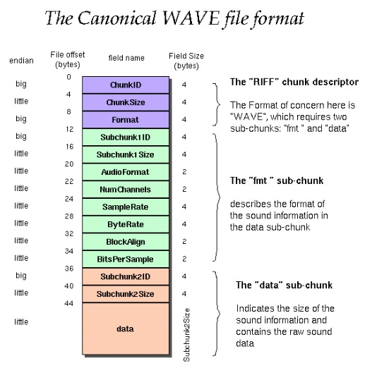
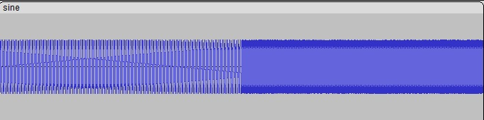
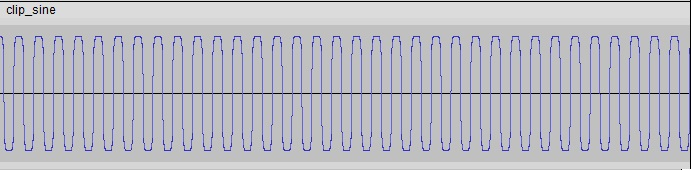
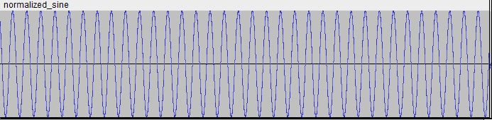
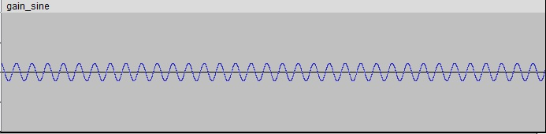
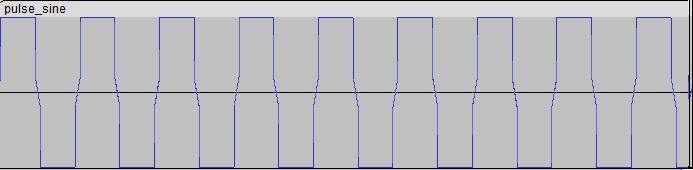

# Clippy - a CLI Audio Distortion Tool

## About
Clippy is a tiny program based on a primitive approach to digital signal (audio) processing, providing only the barebones functionality to which one might expect. Currently supported filters are: *hard-clipping*, *gain/attenuation*, *pulsation* and *normalization*. However, there is also a generically templated Waveform header library, supporting a generic filtering mechanism through supplied filters/effects. The user can also create custom filters following the provided template `MyFilter`, given in the `demo::filters` namespace. 

I'm planning to release these `wav::Waveform` and `wav::WAVHeader` as stand-alone libraries, fully-compatible with all types of WAVE files (when I actually gather the decency to finish them), so for now it's mostly hard-coded for the sake of presentation.
___

## A note on the WAVE file format
There is a lot of quirks when it comes to this file format. WAVE is a part of Microsoft's RIFF (*Resource Interchange File Format*). Main characteristics are that WAVE (`.wav`) files are usually uncompressed, i.e. *lossless*, meaning they scale pretty heavily in respect to the sample rate (bitrate), number of channels and actual data size. The header consists of three necessary chunks:  
* RIFF chunk descriptor,
* 'fmt' (format) sub-chunk,
* 'data' (data) sub-chunk  

Format and data sub-chunks do not follow a strict order, meaning they don't have to follow each other in the header structure. There also can be multiple data sub-chunks (although rarely), each having their own unique 'ID' (*more on that later*).

According to the forementioned while supposing that our WAVE header contains *first the 'fmt', then the 'data' subchunks*, we can form a WAVE header data structure:  
```c
typedef struct {
		/* --- RIFF chunk descriptor --- */
		std::array<char, 4> chunk_id;           // := "RIFF"
		int chunk_size;                         // 4 + 8 + SubChunk1Size + 8 + SubChunk2Size
		std::array<char, 4> format;             // "WAVE" for .wav
        
		/* ------- FMT sub-chunk ------- */
		std::array<char, 4> subchunk1_id;       // := "fmt"
		int subchunk1_size;                     // 16 for PCM
		short audio_format;                     // 1: PCM (uncompressed), != 1: compressed
		short num_channels;                     // 1: mono, 2: stereo ...
		int sample_rate;                        // 8000, 44100, 48000 ...
		int byte_rate;                          // SampleRate * NumChannels * BitsPerSample / 8
		short block_align;                      // NumChannels * BitsPerSample / 8
		short bits_per_sample;                  // 8: 8bpc, 16: 16bpc
        
		/* ------ DATA sub-chunk ------ */
		std::array<char, 4> subchunk2_id;       // := "data"
		int subchunk2_size;                     // NumSamples * NumChannels * BitsPerSample / 8
} WAVHeader;    
```

Which looks something like this (taken from [here](http://soundfile.sapp.org/doc/WaveFormat/)):  
<center>

 

</center>

Here we can notice a couple of things: each chunk (same-colored block) must contain two things:  
1. ID - name of the chunk
2. Size - the total amount of *bytes* which the chunk contains.

Using the `chunk_size` value we can discern the amount of bytes that need to be read, for the chunk initialization to be considered valid. On the picture above, we can notice that the RIFF chunk contains *12 bytes* of data, the format chunk contains *24 bytes* of data, and the data chunk contains *8 + subchunk2_size bytes* of information.

### RIFF chunk descriptor

The RIFF chunk descriptor (RIFX if the byte ordering is big-endian), is a context specification block, which describes: whether the WAVE file uses big- or little- endianness (RIFF or RIFX), its' own size, and the actual file-format (*in our case, always WAVE*).

### Format sub-chunk

The format sub-chunk, besides ID and size, contains most of the specification about the observed waveform file: *audio format, number of channels, sample rate, byte rate, block align, bits per sample and additional data if it has been further encoded (i.e. compressed)*. **Audio format** takes value of `1`, if the WAVE file is encoded using the PCM method, other values indicate some form of compression. **Sample rate** represents the frequency of our samples (actual data). Higher sample rates, in most cases, indicate better sound fidelity (see: [Nyquist-Shannon sampling theorem](https://www.sciencedirect.com/topics/computer-science/shannon-sampling-theorem#:~:text=The%20Nyquist%20Shannon%20sampling%20theorem,%2C%20Fs%20%3D%202%20B.)). **Bits per sample** represents the amount of bits used for a single sample - in 24-bit encoded WAVE-files is a minimum of 3 bytes, 16-bit uses a 2-byte data for storage (*2's complement signed 16-bit integer, `int16_t`*), and 8-bit uses a single-byte data for storage (*e.g. `unsigned char`*).

## Data sub-chunk

The data sub-chunk is pretty straightforward - it contains it's identifier and the actual size of the **DATA BLOCK**, not the 'whole' data chunk. Using the size value located in the data sub-chunk, we can extract the necessary amount of bytes (of raw audio information).  
___

## Usage

*Note:* Currently, only **16-bit, mono-channel, PCM WAVE** files are supported. There are many more changes to come, providing a full-on library to support every kind of a Waveform audio file. Before using, make sure you exported your audio file in this format (*you can check this by going into Audacity, combining multiple channels into mono and exporting as 'Signed 16-bit PCM'*).  

To run the demo showcase, compile it using `g++ demo.cpp -o {filename}` - *NO additional linking* is required, thanks to the *.hpp* pre-compiled headers usage. Then, simply run `demo {sine.wav | voice.wav}` to see the results of applied filtering on your raw data. You will also be presented with your wavefile header information. Pre-generated demo examples are located in the `./modulated_examples/` directory.

### Coding a custom filter

Besides convoluting through the `_data` vector, you can simply apply a single-sample-based filters, such as aforementioned. Use the following (provided) template class:  
```cpp		
        // Template assumes that the sample type is the same as effect value type (i.e. short, short)
		// If you are operating on things such as amplitudes, 
        // then you NEED to specify arguments as, e.g <float, short>
		template <typename EffectValType, typename SampleType = EffectValType> class MyFilter final {
			private:
				EffectValType criteria;

			public:
				// Initialize the criteria for the filter to be applied (not necessary)
				MyFilter(EffectValType value) : criteria(value) {}

				// Perform filtering on the given sample when called as a functor
				SampleType operator()(SampleType& sample) {}
		};
```

___

## Signal modulation effects

Using a sinusoidal wave at 80Hz and 220Hz frequencies, I've been able to apply some effects on the given:

### Original sine wave 
<center>



</center>

### Amped sine wave, clipped at ~+9.5dB (*a third of maximum amplitude*)
<center>



</center>

### Sine wave, normalized (*0dB free dynamic range*)
<center>



</center>

### Sine wave, *attenuated with a 0.3 gain factor *
<center>



</center>

### 'Pulsified' sine wave, *effect-thresholded at a 1/5th of maximum amplitude*
<center>



</center>

___
